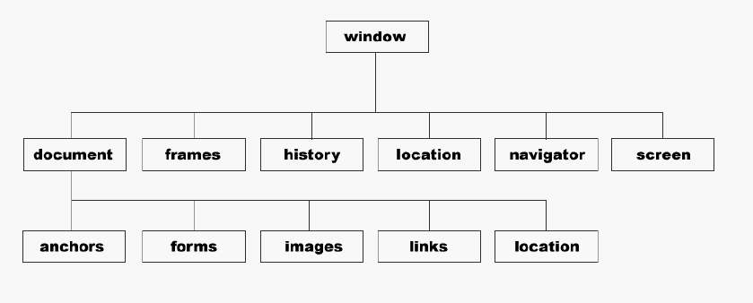

## BOM

####一、window对象

它是最顶层的对象，有六大属性，均是对象，document对象下有五大属性。



调用：window.属性    window.方法()，例如：window.alert('yaoxxx')；

#### 二、系统对话框

##### 1、确定和取消

confirm('balabala')；确定和取消分别返回true和false。

##### 2、输入提示框

prompt('请输入一个数字',0)；返回输入的值,0为默认值

print();   调出打印对话框

find()；调出查找对话框？？？？？？？？？？？

defaultStatus('aaa')；默认初始值    ？？？？？？？

##### 3、新建窗口

```js
open('http://www.baidu.com','baidu');              打开一个窗口
open本身返回window对象

var baidu = open('http://www.baidu.com');     返回子窗口
baidu.alert('Lee');                           表示子窗口弹出
//在子窗口点击父窗口会显示的字
document.onclick = function(){
    window.opener.document.write('子窗口让我输出一行字！')
};

```

##### 4、对窗口的操作


|  属性    | 描述     |
| ---- | ---- |
| screenLeft  | 窗口相对于屏幕左边的位置   |
| screenTop  |  窗口相对于屏幕上边的位置  火狐不支持|
| screenX    | 确定窗口的位置 IE不支持 |
| screenY | 确定窗口的位置 |
|innerWidth|视口的宽|
|innerHeight|视口的高|
|outerWidth|窗口+边框共宽|
|ouoterHeight|窗口+边框共高|
|moveTo(100,100)|移动到100，100的位置|
|moveBy(10,10)|向下及向右移动10,10的位置|
|resizeTo(300,300)|调整窗口的大小|
|resizeBy(-10,-10)|以-10的速度缩小|

跨浏览器获取窗口位置操作：

```java
var leftX = typeof window.screenLeft == 'number' ? window.screenLeft : window.screenX;
var topY = typeof window.screenTop == 'number' ? window.screenTop : window.screenY;
```

跨浏览器(兼容)获取可视窗口：

```java
var width = window.innerWidth;
var height = window.innerHeight;

if(typeof width != 'number'){
    if(document.compatMode == 'CSS!Compat'){
        width = document.documentElement.clientWidth;
        height = document.documentElement.clientHeight;
    }else{
        width = document.body.clientWidth;
        height = document.body.clientHeight;
    }
}
```
超时调用和间歇调用：

```java
setTimeout('代码块'，毫秒数);        //不推荐

function box(){...}                //不推荐
setTimeout(box，毫秒数);

//setTimeout(匿名函数，毫秒数);      //扩展性好，封装性好
var box = setTimeout(function(){
  	alert('WY');
}，毫秒数);

//取消超时调用
var box = setTimeout(function(){       //box返回一个ID
  	alert('WY');
}，毫秒数);
clearTimeout(box);

//间歇调用,重复不断地执行
var box = setInterval(function(){
    alert('WY');
},1000)
clearInterval(box);

//使用超时调用，模拟定时
var num = 0;
var max = 5;
function box(){
  num++;
  if(num == max){
    alert('5秒到了');
  }else{
    setTimeout(box,1000);           //递归调用
  }
}
setTimeout(box,1000);
```

#### location对象

```java
//返回当前URL
window.location;
window.document.location;
```

| location对象                             | 描述                     |
| ---------------------------------------- | ------------------------ |
| location.hash = '#1'                     | 设置#后的字符串，并跳转  |
| location.port = 8888                     | 设置端口号，并跳转       |
| location.hostname = 'WY'                 | 设置主机名，并跳转       |
| location.search = '？id=5'               | 不停跳转                 |
| location.href = 'http://www.baidu.com'   | 设置跳转的URL    常用    |
| location.assign('http://www.baidu.com')  | 跳转到指定的URL          |
| location.reload()                        | 有效的重新加载           |
| location.reload(true)                    | 从源头加载               |
| location.replace('http://www.baidu.com') | 不产生任何历史记录的跳转 |


```java
//获取URL参数   ?id=9&search=error
function getArgs(){
  	var qs = location.search.length > 0 ? location.search.substring(1) : 'null';
    var items = qs.split('&');
    var item = [];
    var args = [];
    var name,value;
  for(var i = 0; i<item.length; i++){
    item = items.split('=');
    name = item[0];
    value = item[1];
    args[name] = value;
  }
}
var args = getArgs();
alert(args['id']);
alert(args['search']);
```

#### history对象

保存用户上网记录

| history方法        | 描述1           |
| ------------------ | --------------- |
| history.back();    | 回到前一条记录  |
| history.forward(); | 下一条记录      |
| go(num);           | 1下一    -1上一 |

```html
<a href="javascript:back();">prev</a>
<a href="javascript:next();">next</a>
<a href="javascript:go(2);">go2</a>
```

```js
 function back(){
  history.back();
}
```