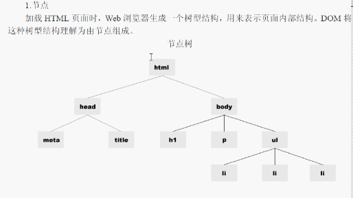

## DOM

#### 1、介绍

有三个等级：DOM1 、 DOM2、 DOM3 

IE中的DOM对象都是以COM对象的形式实现的，故IE的DOM会和其他浏览器有差异



#### 2、查找元素
元素节点方法
| 方法                         | 描述                                         |
| ---------------------------- | -------------------------------------------- |
| getElementById('id')         | 通过ID,j建议区分大小写 HTMLDivElement        |
| getElementsByTagName('li')   | 参数传递标签名，返回一个数组集合             |
| getElementsByName('li')      | 通过name获取，返回一个数组集合，注意是否合法 |
| getAttribute('id')           | 获取元素中某个属性的值                       |
| setAttribute('属性名'，‘值’) | 设置元素中某个属性和值                       |
| removeAttribute()            | 移除元素节点中某个属性                       |


**input中有合法的name属性，div没有**
获得元素属性

| 属性                       | 描述                                             |
| -------------------------- | ------------------------------------------------ |
| box.tagName                | 获取这个元素节点的标签名                         |
| box.innerHTML              | 获取和赋值这个元素节点的纯文本内容，包含HTML标签 |
| box.id                     | 获取这个元素节点的id属性的值，不是属性节点       |
| box.title                  | 获取这个元素节点的title属性的值                  |
| box.style                  | 获取style属性对象                                |
| box.style.color            | 获取style属性中color属性的值                     |
| box.className              | 获取class属性的值                                |
| 自定义属性只有IE可以获取到 | 要么做兼容，要么不使用                           |

**注意：**
onload事件，预加载后执行（所有网页的内容都加载完毕后，再执行的代码）
```js
window.onload= function(){
	var  str = document.getElementByid（'id'）;
}
```

#### 3、DOM节点

节点分为元素节点、属性节点、文本节点。

1、节点属性：

- 元素.nodeType；    //1.元素节点 2.属性节点 3. 文本节点
- 元素.nodeName；  //输出元素名称，属性名称，#text
- 元素.nodeValue；  //元素节点输出null，属性节点输出属性值，文本节点输出文本内容（不包含html）

2、层次节点属性

层次结构划分为：父节点与子节点、兄弟节点两种

- childNodes  ： 获得当前元素节点所有子节点，返回一个数组
- firstChild ：获得当前元素节点第一个子节点
- lastChild ：获得当前元素节点最后一个子节点
- ownerDocument：获得该节点的文档根节点，相当于document
- parentNode：获得当前节点的父节点
- previousSibling：获得当前节点同级的前一个节点
- nextSibling：获得当前节点同级的后一个节点
- attributes[]：获得当前元素节点的所有属性节点集合

**示例**

```html
<div>
    测试DIV<em>测试EM</em>结尾   //前后两个文本节点，中间是元素节点
</div>
```

**注意：**innerHTML和nodeValue的区别：

- 获取：文本节点无法使用innerHTML标签输出文本内容

- 赋值：innerHTML：输出文本内容，可以包括标签

  ​            nodeValue：会将标签输出

**示例：**忽略空白文本节点：直接删除空位文本节点即可

```js
function filterSpaceNode(nodes){
    for(var i=0;i<nodes.length;i++){
        if(nodes[i].nodeType == 3 && /^\s+$/.test(nodes[i].nodeValue)){
            //得到空白节点之后，回到父节点之后删除子节点
            nodes[i].parentNode.removeChild(nodes[i]);
        }
    }
}
```
#### 4、节点操作：创建、复制、插入、删除、替换节点

document.write('<p>这是一个段落！</p>')；将任意字符串插入到文档

createElement('p')；创建一个元素节点

appendChild()；将一个新节点添加到某个子节点的末尾上

createTextNode()；创建一个文本节点

insertBefore(p,box)；把节点插入到指定节点的前面

replaceChild(p,box)；把节点替换成指定的节点,div换成了p

cloneNode(true)；把子节点复制出来，true表示复制内容，false表示只复制标签

removeChild()；删除指定节点