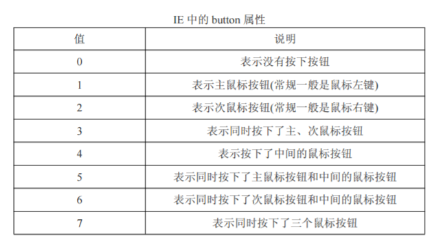
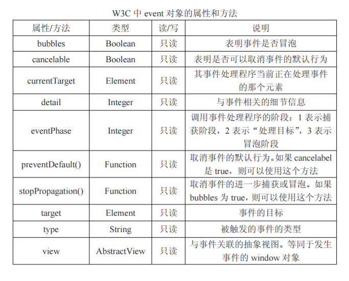
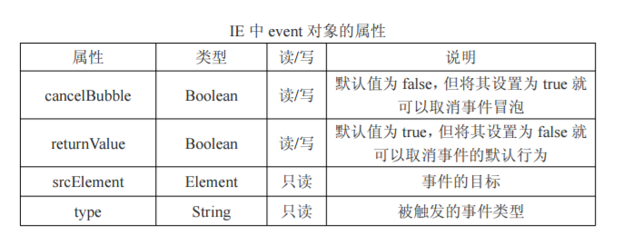
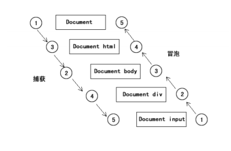

## 事件对象

学习要点：

- 事件对象
- 鼠标事件
- 键盘事件
- W3C与IE

#### 1、事件对象

事件处理分三部分组成：对象.事件处理函数 = 函数

事件对象，一般称为event对象，是浏览器通过函数把这个对象作为参数传递过来的。

```js
var input = document.getElementsByTagName('input')[0];
input.onclick = function(evt){
    alert(evt);                 //MouseEvent,鼠标事件对象
}
```

IE存在兼容性问题：

```js
window.onload = function(){
    document.onmouseup = function(evt){
        var e = evt || window.event;        //W3C || IE
        alert(e.button);
    }
}
```

#### 2、鼠标事件

- 鼠标按钮

在它的event中存在一个button属性，表示按下或释放按钮。**通过event.button获取**

*非IE中的button属性 

| 值 | 说明 |
| ---- | ------------------------------ |
| 0    | 表示主鼠标按钮（鼠标左键）     |
| 1    | 中间的鼠标按钮（鼠标滚轮按钮） |
|2 | 次鼠标按钮（鼠标右键）|

*IE中的button属性



存在兼容性问题，switch 语句可解决

```js
function getButton(evt){
    var e = evt || window.event;               //判断顺序先W3C再IE,因为谷歌都支持
    if(evt){                 //W3C
        return e.button;
    }else if(window.event){  //IE
        switch(e.button){
            case 1:
                return 0;
            case 4:
                return 1;
            case 2:
                return 2;
        }
    }
}

//调用
document.onmouseup = function(evt){
    if(getButton(evt) == 0)
        alert('按下了左键');
    if(getButton(evt) == 1)
        alert('按下了中键');
    if(getButton(evt) == 2)
        alert('按下了右键');
};
```

- 可视区及屏幕坐标

事件对象提供了两组获取浏览器坐标的属性。**可视区左边**和**屏幕坐标**。

| 属性 | 说明 |
|---|---|
|clientX|可视区X坐标|
|clientY|可视区Y坐标|
|screenX|屏幕区X坐标|
|screenY|屏幕区Y坐标|

```js
document.onclick(event){
    var e = event || window.event;
    alert(e.screenX + ',' +e.screenY);            //距离屏幕
    alert(e.clientX +',' +e.clientY);			 //距离可视区
}
```

- 修改键

有时需要某些键来配合鼠标来触发一些特殊的事件。Shift、Ctrl、Alt、Win。经常被用来修改鼠标事件和行为。

修改键属性

|属性|说明|
|---|---|
|shiftKey|判断是否按下了Shift键|
|ctrlKey|判断是否按下了ctrlKey键|
|altKey|判断是否按下了alt键|
|metaKey|判断是否按下了windows键，IE不支持|


```js
function getKey(evt){
    var e = evt || window.event;
    var keys = [];
    
    if(e.shiftKey)            //为数组添加元素
        keys.push('shift');
    if(e.ctrlKey)
        keys.push('ctrl');
    if(e.altKey)
        keys.push('alt');
    return keys;
}

//调用
document.onclick = function(evt){
    alert(getKey(evt));
};
```

#### 3、键盘事件

keydown  :  按下任意键，按下立即触发

keyup  :  弹起任意键，按下然后释放触发

keypress：按下字符键，abc,123,特殊字符之类的，不包括shift、ctrl等


键码：键盘上的任意键，返回的是ASC码的小写字母对应的值，在字符上和字符编码的asc码是一致的。

```js
window.onload = function (){
    document.onkeydown = function(evt){
        var e = evt || window.event;
        alert(e.keyCode);
    }
}
```

charCode在使用keypress的情况下，会返回字符键盘的ASC编码。

```js
window.onload = function (){
    document.onkeypress = function(evt){
        var e = evt || window.event;
        alert(e.charCode);
    }
}
```

需要做兼容，不同浏览器不同。

#### 4、W3C和IE





事件流，当几个具有时间的元素重叠在一起的时候，在点击的时候，在点击范围内的所有元素都会触发事件。

事件流包括两种模式：冒泡和捕获。



会优先触发到最内层的事件：

```js
document.onclick = function(){
    alert('document');
};
document.documentElement.onclick = function(){
    alert('HTML');
};
document.body.onclick = function(){
    alert('body');
};
document.getElementById('box').onclick = function(){
    alert('div');
};
document.getElementsByTagName('input')[0].onclick = function(){
    alert('input');  
};
```

阻止冒泡的方式：

```js
function stopBubble(evt){
    var e = evt || window.event;
    window.event?e.cancelBubble = true : e.stopPropagtion();   //IE与W3C不同
}
```

