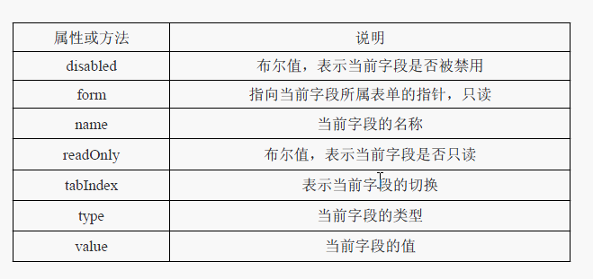
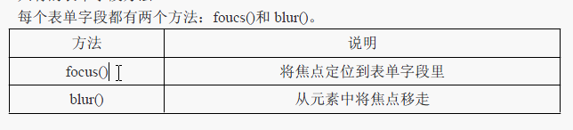
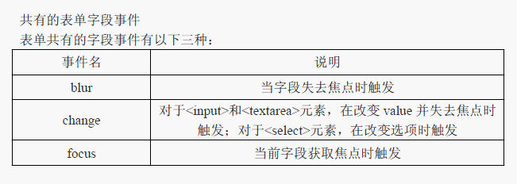

## 表单处理

学习要点：

- 表单介绍
- 文本框脚本
- 选择框脚本

### 一、表单介绍

##### 1、得到一个表单：

通过id和标签名得到表单对象

##### 2、阻止表单提交：

```js
 addEvent(fm,'submit',function(evt){
    var e = evt || window.event;
    if(e.preventDefault)
    	e.preventDefault();
    else
        e.returnValue = false;
});
```

##### 3、自定义表单提交事件（使非submit按钮提交表单）

```js
//span.click
document.keydown = function(evt){
    var e = evt || window.event;
    if(e.ctrlKey && e.keyCode == 13)     //判断按住了ctrl和enter键，就触发
    fm.submit();
}
```

##### 4、避免表单中命名含有submit等敏感字符

##### 5、避免重复提交

在第一次提交之后将按钮禁用，并设置flag标志已经提交过一次了

##### 6、重置按钮

用法和submit相同，作用是将表单内容清空。

##### 7、表单控件

input submit textarea  select 

##### 8、表单字段的访问

fm.elements[0]；            //获取第一个表单字段元素

fm.elements['user']；    //通过name获取表单元素，可能是一个节点列表

##### 9、共有的表单字段属性



fm.elements[0].name ；        //得到name属性

fm.elements[0].disabled == true ；    //得到禁用属性并设置为禁用

不推荐使用type属性修改元素的类型 

##### 10、共有的表单字段方法



##### 11、共有的表单字段事件



### 二、文本框脚本

类型：多行文本框<textarea与单行文本框<input type="text"

1、获取文本的值

value：内容写在标签之间，HTML中没有value属性，JS中value属性用于获取标签之间

defaultValue：获取在HTML标签中设置的初值

2、选定文本的值

select：选定文本

setSelectionRange(0,1)：选定部分文本，第0个位置到第一个位置

IE存在兼容性问题：

select事件，选定文本就触发，传this并通过this.value获取全部文本。

3、取得选择的文本

//IE不支持

addEvent(textFiele,'select',function(){

​	alert(this.value.substring(this.selectionStart，this.selectionEnd))；

})

//IE

document.selection.createRange().text；

### 选择框脚本

通过select和option元素创建

```html
<form>
    <select name="city" multiple="multiple">
        <option value="北京v">北京</option>
        <option value="上海v">上海</option>
        <option value="广州v">广州</option>
    </select>
</form>
```

```js
window.onload = function () {
    var fm = document.getElementsByTagName('form')[0];
    var city = fm.elements[0];

    //属性 也可以在HTML标签中设置   multiple="multiple" 和 size="3"
    // city.multiple=true;    支持多选
    // city.size=2;            显示的行数

    //标准DOM获取属性的值：不推荐
   /* alert(city.options[0].firstChild.nodeValue);
    alert(city.options[0].getAttribute('value'));
    
    //HTML DOM兼容性很好，推荐
    alert(city.options[0].value);
    alert(city.options[0].text);*/

    // 该属性属于select对象
    // city.selectedIndex=2;

    //该属性属于option对象
    //city.options[2].selected = true;

    //添加一个option：三种方法
    var option = document.createElement('option');
    //法一：
    var text = document.createTextNode('深圳');
    option.setAttribute('value','深圳v');

    //法二：
    //option.value = '深圳v';
    //option.text = '深圳';
    option.appendChild(text);
    city.appendChild(option);

    //法三：构造函数，并能指定位置
    var opt = new Option('北京t','北京v');
    city.add(opt,3);

    //移除：两种方法
    //city.removeChild(city.options[0]);
    //city.remove(0);

}
```

