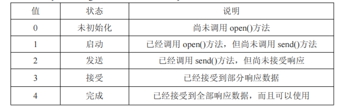

## AJAX

学习要点：

- XMLHttpRequest
- GET和POST
- 封装Ajax

一种无刷新提交技术

#### 一、XMLHTTPRequest

AJAX技术的核心是XHR对象

```js
//创建xhr对象
var xhr = new XMLHttpRequest();
//调用open方法：表示准备请求（1get方式请求  2请求的URL 3是否同步）
 xhr.open('get','demo.php',false);
//send方法发送请求（get不需要数据请求，则为null）
 xhr.send(null);
```

请求发送到服务端后：响应的数据会自动填充XHR对象的以下四个属性：

|属性名|说明|
|---|---|
|responseText|作为响应主体被返回的文本|
|responseXML|如果响应主体是xml文件，包含|
|status|响应的HTTP状态|
|statusText|HTTP状态的说明|

```js
//可以绑定在点击事件里，只要点击就能实时获得最新的数据
var xhr = new XMLHttpRequest();
xhr.open('get','demo.php',false);
xhr.send(null);
if(xhr.status == 200){          //成功的状态码：200
    alert(xhr.responseText);
}else{
    //打印服务器返回的数据
	alert(xhr.responseText);         //2018-03-34 
}
xhr.abort();           //取消异步请求
```

**异步调用：**需要触发readystatechange事件------》检测readyState属性即可，有五个值：



```js
var xhr = new createXHR();
xhr.onreadystatechange = function () {
	if (xhr.readyState == 4) {
	if (xhr.status == 200) {
		alert(xhr.responseText);
	} else {
		alert('数据返回失败！状态代码：' + xhr.status + '状态信息：' + xhr.statusText);
	}
}
};
xhr.open('get', 'demo.php?rand=' + Math.random(), true);
xhr.send(null);
```

#### 二、GET与POST

HTTP头信息：服务器返回的响应头信息    和    客户端发送出去的请求头信息。

```js
//获取单个响应头信息
xhr.getResponseHeader('Content-Type');
//获取整个响应头信息
xhr.getAllResponseHeaders();
//设置单个请求头信息
xhr.setResquestHeader('MyHeader','yaoxxx');
```

GET请求：通过 URL 后的问号给服务器传递键值对数据，特殊字符传参可以使用encodeURIComponent()进行编码处理。

```js
xhr.open('get', 'demo.php?rand=' + Math.random() + '&name=Koo', true);
```

POST请求：通过send方法向服务器提交数据

```js
xhr.send('name=Lee&age=100');
//需要特别的处理
xhr.setRequestHeader('Content-Type', 'application/x-www-form-urlencoded');
```

#### 三、封装AJAX

```js
function ajax(obj) {
	var xhr = new createXHR();
	obj.url = obj.url + '?rand=' + Math.random();
	obj.data = params(obj.data);
	if (obj.method === 'get') obj.url = obj.url.indexOf('?') == -1 ?
obj.url + '?' + obj.data : obj.url + '&' + obj.data;
	if (obj.async === true) {
		xhr.onreadystatechange = function () {
			if (xhr.readyState == 4) callback();
		};
	}
	xhr.open(obj.method, obj.url, obj.async);
	if (obj.method === 'post') {
		xhr.setRequestHeader('Content-Type', 'application/x-www-form-urlencoded');
		xhr.send(obj.data);
	} else {
		xhr.send(null);
	}
	if (obj.async === false) {
		callback();
	}
    
    
	function callback () {
		if (xhr.status == 200) {
			obj.success(xhr.responseText); //回调
		} else {
			alert('数据返回失败！状态代码：' + xhr.status + '，
				状态信息：' + xhr.statusText);
		}
	}
}

//调用 ajax
addEvent(document, 'click', function () { //IE6 需要重写 addEvent
	ajax({
	method : 'get',
	url : 'demo.php',
	data : {
	'name' : 'Lee',
	'age' : 100
	},
	success : function (text) {
		alert(text);
	},
	async : true
	});
});
//名值对编码
function params(data) {
	var arr = [];
	for (var i in data) {
		arr.push(encodeURIComponent(i) + '=' + encodeURIComponent(data[i]));
	}
	return arr.join('&');
}
```


