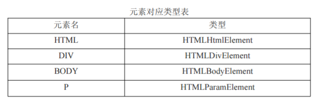

## DOM进阶

### 一、DOM类型

#### 1、Node类型

node.ELEMENT_NODE        //元素节点类型值

#### 2、document类型

document类型表示文档，或文档的根节点，隐藏，无具体的元素标签

document.documentElement;              //HTMLHtmlElement

document.body;                                      //HTMLBodyElement

document.doctype;                                //DocumentType

document.childNode[0].nodeName;   //Comment

属性：

document.title                     //获取和设置title标签的值

document.URL                    //获取URL路径

document.domin                //获取域名，服务器端

document.referrer              //获取上一个URL，服务器端

对象：

document.form                 //获取文档中<form>表单元素集合

#### 3、Element类型

元素对应类型表：

#### 4、Text类型

box.normalize();                   //合并box下两个相邻的文本节点

box.firstChild.splitText(3)           //分离一个节点

#### 5、Comment类型

nodeType：8；nodeName：#comment；nodeValue：注释的内容

### 二、DOM扩展

#### 1、呈现模式

标准模式：document.compatMode == 'CSS1Compat'

混杂模式：document.compatMode == 'BackCompat'

#### 2、滚动

document.getElementById('box').scrollIntoView()   //设置指定可见

#### 3、children属性

box.children.length;              //得到子节点数目

#### 4、contains方法

判断一个节点是否是另一个节点的后代

### 三、DOM操作内容

#### 1、innerText属性

获取文本内容及设置文本，会过滤掉html

相似属性：textContent  

#### 2、innerHTML

不拒绝HTML，可获取可解析

#### 3、outerText

赋值时会将元素直接抹去,不推荐

#### 4、outerHTML

同上，不推荐

