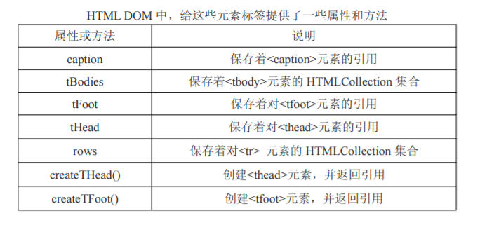
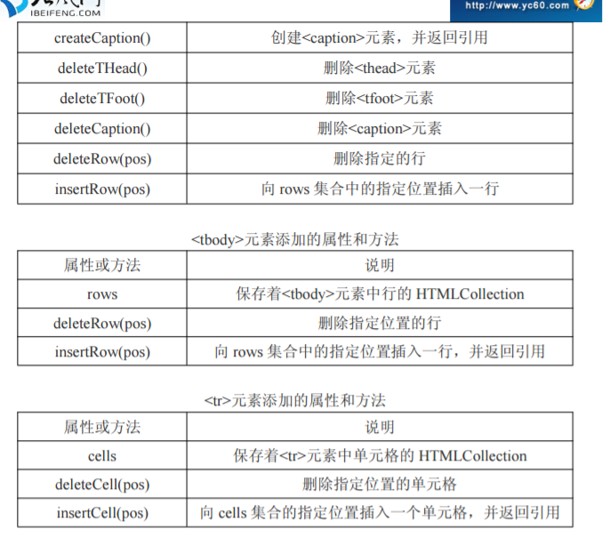
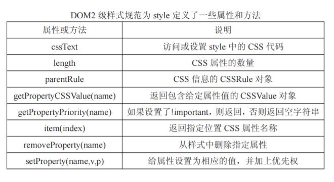

##通过DOM操作表格及样式

### 要点：

- 操作表格
- 操作样式

#### 一、操作表格

一些属性和方法：





```js

//操作表格
window.onload = function(){
    var table = document.getElementByTagName('table')[0];
    table.caption.innerHTML;           //获取caption

    table.tHead;
    table.tBodies;

    table.rows.length;
    table.tBodies[0].rows.length;           //表体的行数

    table.tBodies[0].rows[0].cells.length;  //第一行的单元格数目

    table.tBodies[0].rows[1].cells[1].innerHTML;  //第二行第二个单元格内容
    
    table.deleteCaption();                    //删除标题
    table.deleteTHead();                      //删除头
    table.tBodies[0].deleteRow(0);            //删除行
    table.tBodies[0].rows[0].deleteCell(0);   //删除单元格
}


//创建表格
window.onload = function(){
    var table = document.createElement('table');
    table.border = 1;
    table.width = 300;

    var caption = document.createElement('caption');
    table.appendChild(caption);
    caption.innerHTML = '人员表';

    var thead = document.createElement('thead');
    table.appendChild(thead);
    var tr = document.createElement('tr');
    thead.appendChild(tr);
    var th = document.createElement('th');
    tr.appendChild(th);
    //th.innerHTML = 'one';
    var thtext = document.createTextNode('Text');
    th.appendChild(thtext);

    document.body.appendChild(table);
}
```

#### 二、操作样式

检测浏览器是否支持DOM1级CSS能力或DOM2级CSS能力

```js
document.implementation.hasFeature('CSS','2.0');      //支持就返回true
document.implementation.hasFeature('CSS2','2.0');
document.implementation.hasFeature('HTML','2.0');*/
```

#####1、style属性访问元素样式（优点：可赋值可取值，缺点：只能获取行内样式）   行内 、内联style标签 、链接link  

```js
//获取box元素
var div = document.getElementById('con');
//可赋值可取值
alert(div.style.float);                //right
alert(div.style.backgroundColor);      //red
//修改有效
div.style.float = 'left';
//删除和添加属性
div.style.removeProperty('backgroundColor');
div.style.setProperty('color','blue');
```




##### 2、计算样式访问（优点：可以获取所有样式  缺点：不能赋值只能获取）

```js
//(不管在哪里设置CSS,都会驻留在浏览器内存中，故都可以获取到)，但不能赋值
var div = document.getElementById('con');
//null表示无伪类（:hover）
var style = window.getComputedStyle(div,null);
alert(style.float);

//border属性获取不到，被计算后不存在，属于复合性属性
```

总结：三种操作CSS的方法：

- style行内，可读可写；
- 使用getComputedStyle或currentStyle，可读不可写；
- cssRules或rules，内联和链接，可读可写

##### 3、

查看是否支持DOM2级样式表

```js
document.implementation.hasFeature('StyleSheets','2.0');
```

获取样式元素：

```js
document.getElementsByTagName('link')[0];         //HTMLLinkElement

document.getElementsByTagName('style')[0];       //HTMLStyleElement
```

属性和方法：

|属性和方法|说明|
|---|---|
|disabled|获取和设置样式表是否被禁用|
|href|通过link包含的，则获取URL，否则为null|
|media|样式表支持的所有媒体类型的集合|
|ownerNode|指向拥有当前样式表节点的指针|
|parentStyleSheet|@import导入的情况下，得到父CSS对象|
|title|ownerNode中title属性的值|
|type|样式表类型字符串|
|cssRules|样式表包含样式规则的集合|
|deleteRule(index)|删除cssRules集合中指定位置的规则|
|insertRule(rule,index)|向cssRules集合中插入rule字符串|

```js
var link = document.getElementsByTagName('link')[0];  //HTMLLinkElement
//法1得到CSSStyleSheet(主要)
var sheet = link.sheet || link.style.sheet;          //得到CSSStyleSheet

sheet.disabled;                //false ,可设置为true
sheet.href;                    //CSS文件位置的URL   file://D:work/gitalab/js/day../bom.css
sheet.media;                   //MediaList,集合     Object MediaList
sheet.title;                   //得到title属性的值   <link>标签中的属性
sheet.deleteRule(0);           //删除第一个样式规则（id或class选择器）
sheet.insertRule('body{background-color:red}',0);        //在第一个位置添加一个样式规则

//法2得到CSSStyleSheet
var sheet = document.styleSheets[0];
var rules = sheet.cssRules || sheet.rules ;
var rule = rules[0];
alert(rule.cssText);
```


