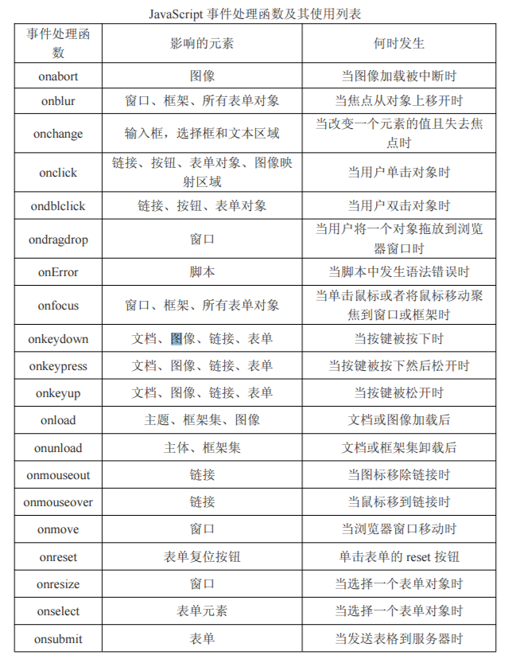

## 事件入门

学习要点：

- 事件介绍
- 内联模型
- 脚本模型
- 事件处理函数

#### 1、事件介绍

Javascript有三种事件模型：**内联模型**、**脚本模型**和**DOM2模型**。

#### 2、内联模型

不与HTML分离的市价能处理函数

```html
<input type = 'button' value = '点我' onclick = "alert('yaoxxx');"/>
```

#### 3、脚本模型

为解决内联，在js脚本中处理事件，这样的方式称为脚本模型

```js
var input = document.getElementsByTagName('input')[0];
//通过匿名函数可以直接触发相应的代码
input.onclick = function (){
    alert('Lee');
};
//也可以将函数名赋给事件
input.onclick = box;
```

#### 4、事件处理函数

事件类型分为：鼠标事件、键盘事件和HTML事件。



- 鼠标事件：

  - onclick：点击鼠标按钮或按下回车键时触发
  - ondbclick：双击主鼠标按钮时触发
  - onmousedown：按下鼠标还未弹起时触发
  - onmouseup：释放鼠标按钮时触发
  - onmouseover：鼠标移到你某个元素上方时触发
  - onmouseout：移出某个元素上方时触发
  - onmousemove：在元素上移动时触发

- 键盘事件：

  - onkeydown：按下键盘任意键触发
  - onkeypress：按下键盘上的字符键触发，如果按住不放，会重复触发
  - onkeyup：释放键盘上的键触发

- HTML事件：

  - window.onload：当页面完全加载后在window上面触发，或当框架加载完毕后在框架集上触发
  - window.onunload：当页面完全卸载后在window上面触发，或当框架集卸载后在框架集上触发
  - select：当用户选择文本框（input或textarea）中的一个或多个字符触发
  - change：当文本框（input或textarea）内容改变且失去焦点后触发
  - focus：当页面或者元素获得焦点时在window及相关元素上面触发
  - blur：当页面或元素失去焦点时在window及相关元素上触发
  - submit：点击提交按钮在form元素上触发
  - reset：点击重置按钮在form元素上触发
  - resize：当窗口或框架的大小变化时在window或框架上触发
  - scroll：当用户滚动带滚动条的元素时触发

  