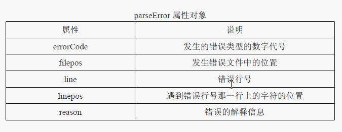

## XML

学习要点：

- IE中的XML
- DOM2中的XML
- 跨浏览器处理XML

一个微型的结构化的数据库，保存一些小型数据用的 

#### 一、IE中的XML

```js
window.onload = function () {

//载入XML文件的两种方式：1、加载XML字符loadXML();2。加载XML外部文件load()
//由于XML和XHTML一样，都是通过DOM节点操作的，所以之前的知识都可以用得上
    var xmlDom = createXMLDOM();
    xmlDom.loadXML('<root>\n<user>yaoxxx</user>\n</root>');
    //序列化xml字符串
    alert(xmlDom.xml);
}
```

同步和异步：
同步：加载XML完成之前，代码不会继续执行，直到完全加载了XML再返回。

```js
xmlDom.async = false;
```

异步：加载XML时，JS会把任务丢给浏览器内部后台去处理，不会造成堵塞，但要配合readystatechange事件使用，通常我们都采用异步

```js
xmlDom.async = true;             //默认使用异步加载
```

xml中readystatechange事件

| 就绪状态（.readyState属性） | 说明 |
| -------- | ---- |
| 1        |  DOM正在加载    |
|2|DOM已经加载完数据|
|3|DOM已经可以使用，但某些部分还无法访问|
|4|DOM已经完全可以|
|PS:readyState可以获取就绪状态值||

存在问题：服务器使用的是异步加载，但未加载完就序列化得不到字符串，**解决办法：**

```js
var xmlDom = createXMLDOM();
xmlDom.asyc = true;
//这个事件必须放在load前面，意图先载入事件
xmlDom.onreadystatechange = function(){
    //有4种状态,故会输出4次
    alert(xmlDom);
    //输出1次
    if（xmlDom.readyState == 4）{
        if(xmlDom.parseError.errCode == 0){
        	alert(xmlDom.xml);
        }else{
            throw new Error('错误行号：'+xmlDom.parseError.line+'\n错误代号:'+xmlDom.parseError.errCode+'错误解释:'+xmlDom.parseError.reason)
        }
    }
}
//真正加载，激活它
xmlDom.load('demo.xml');
```

 打印错误



示例如上：

#### 二、DOM2中的XML

1、创建

2、载入

DOM2 只支持 load()方法，载入一个同一台服务器的外部 XML 文件。当然，DOM2 也 有 async 属性，来表面同步或异步，默认异步。 

```js
//同步情况下
var xmlDom = document.implementation.createDocument('','root',null);
xmlDom.async = false;
xmlDom.load('test.xml');
alert(xmlDom.getElementsByTagName('user')[0].tagName);

//异步情况下
var xmlDom = document.implementation.createDocument('','root',null);
xmlDom.async = true;
addEvent(xmlDom, 'load', function () { //异步直接用onload 即可
alert(this.getElementsByTagName('user')[0].tagName);
});
xmlDom.load('test.xml');
```

3、没有loadXML方法直接解析XML字符串

```js
var xmlParser = new DOMParser(); //创建 DOMParser 对象
var xmlStr = '<user>Lee</user></root>'; //XML 字符串
var xmlDom = xmlParser.parseFromString(xmlStr, 'text/xml'); //创建 XML DOM 对象
alert(xmlDom.getElementsByTagName('user')[0].tagName); //获取 user 元素标签名
```

4、没有序列化XML的属性，所以提供了 XMLSerializer 类型来帮助序列化 XML 字符串。 

```js
var serializer = new XMLSerializer(); //创建 XMLSerializer 对象
var xml = serializer.serializeToString(xmlDom); //序列化 XML
alert(xml);
```

5、解析错误

在 DOM2 级处理 XML 发生错误时，并没有提供特有的对象来捕获错误，而是直接生 成另一个错误的 XML 文档，通过这个文档可以获取错误信息。 

```js
var errors = xmlDom.getElementsByTagName('parsererror');
if (errors.length > 0) {
throw new Error('XML 格式有误：' + errors[0].textContent);
}
```

